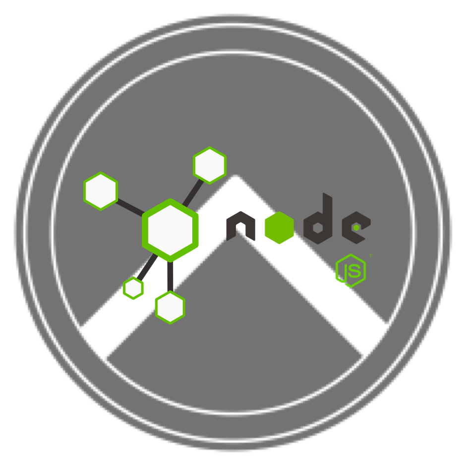

[![MIT License][license-shield]][license-url]
[![LinkedIn][linkedin-shield]][linkedin-url]

<!-- PROJECT LOGO -->
<br />
<p align="center">
  <a href="https://github.com/marinrusu1997/thermopylae">
    
  </a>
</p>

<h3 align="center">Thermopylae</h3>

<p align="center">
<a href="https://188.208.123.37">View Demo</a>
·
<a href="">Report Bug</a>
·
<a href="">Request Feature</a>
</p>

<!-- TABLE OF CONTENTS -->
<details open="open">
  <summary>Table of Contents</summary>
  <ol>
    <li>
        <a href="#about-the-project">About The Project</a>
        <ul>
            <li><a href="#description">Description</a></li>
            <li><a href="#prerequisites">Prerequisites</a></li>
            <li><a href="#packages">Packages</a></li>
            <li><a href="#installation">Installation</a></li>
        </ul>
    </li>
    <li><a href="#contact">Contact</a></li>
  </ol>
</details>

<!-- ABOUT THE PROJECT -->

## About The Project

### Description

Thermopylae is a web security framework written in TypeScript for NodeJS platform. <br/>
It provides a collection of reusable components needed for implementation of authentication and user session management.

### Prerequisites

- UNIX OS
- NodeJS >= v16

### Packages

Thermopylae contains a set of packages which can be used standalone and independently of each other, as they encapsulate
specific features. Nevertheless, most often you will use a combination of them in order to achieve your goal.

Packages are grouped in 2 categories:

- **Library** packages (_lib._ prefix) encapsulate the low level core logic for specific features (e.g. authentication, session, cache), are highly configurable and use abstractions for data storages, algorithms etc.
- **Core** packages (_core._ prefix) are using libraries in order to implement higher level features, usually they are http bound, and also provides default implementations for abstractions required by libraries.

### Installation

All packages are available on npm repository and can be installed with your favourite package manager.
Example:

```sh
npm i @thermopylae/lib.authentication
```

<!-- CONTACT -->

## Contact

👤 **Rusu Marin**

- GitHub: [@marinrusu1997](https://github.com/marinrusu1997)
- Email: [dimarusu2000@gmail.com](mailto:dimarusu2000@gmail.com)
- LinkedIn: [@marinrusu1997](https://www.linkedin.com/in/rusu-marin-1638b0156/)

<!-- MARKDOWN LINKS & IMAGES -->
<!-- https://www.markdownguide.org/basic-syntax/#reference-style-links -->

[license-shield]: https://img.shields.io/github/license/othneildrew/Best-README-Template.svg?style=for-the-badge
[license-url]: https://github.com/marinrusu1997/thermopylae/blob/master/LICENSE
[linkedin-shield]: https://img.shields.io/badge/-LinkedIn-black.svg?style=for-the-badge&logo=linkedin&colorB=555
[linkedin-url]: https://www.linkedin.com/in/rusu-marin-1638b0156/
