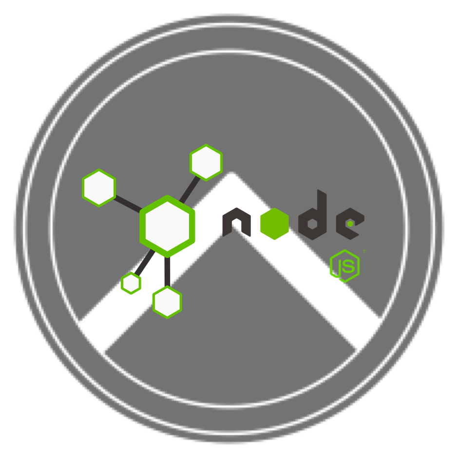

.. Thermopylae documentation master file, created by
   sphinx-quickstart on Thu Jul  1 12:25:51 2021.
   You can adapt this file completely to your liking, but it should at least
   contain the root `toctree` directive.

Thermopylae
===========

**1. Description**

Thermopylae is a web security framework written in TypeScript for NodeJS platform.
It provides a collection of reusable components needed for implementation of authentication and user session management.

**2. Prerequisites**

* UNIX OS
* NodeJS >= v16

**3. Packages**

Thermopylae contains a set of packages which can be used standalone and independently of each other, as they encapsulate
specific features. Nevertheless, most often you will use a combination of them in order to achieve your goal.

| Packages are grouped in 2 categories: library and core.
| **Library** packages (*lib.* prefix) encapsulate the low level core logic for specific features (e.g. authentication, session, cache), are highly configurable and use abstractions for data storages, algorithms etc.
| **Core** packages (*core.* prefix) are using libraries in order to implement higher level features, usually they are http bound, and also provides default implementations for abstractions required by libraries.

**4. Installation**

All packages are available on npm repository and can be installed with your favourite package manager.
::

   npm i @thermopylae/lib.authentication

**5. Contributing**

FIXMEEEEE

**6. License**

This project is MIT licensed.

**7. Contact**

| Email: `<dimarusu2000@gmail.com>`_
| Linkedin: `marinrusu1997 <https://linkedin.com/in/marinrusu1997>`_

Contents
========

.. toctree::
   :maxdepth: 2
   :caption: Authentication:

   lib-authentication.rst
   core-authentication.rst

.. toctree::
   :maxdepth: 2
   :caption: Session Management:

   session-management.rst
   lib-user-session-commons.rst
   lib-user-session.rst
   lib-jwt-user-session.rst
   core-user-session-commons.rst
   core-cookie-session.rst
   core-jwt-session.rst

.. toctree::
   :maxdepth: 2
   :caption: Http Adapters:

   http-adapters.rst
   core-adapter-express.rst
   core-adapter-fastify.rst

.. toctree::
   :maxdepth: 2
   :caption: Database Clients:

   core-mysql.rst
   core-redis.rst

.. toctree::
   :maxdepth: 2
   :caption: Core Commons:

   core-logger.rst
   core-declarations.rst

.. toctree::
   :maxdepth: 2
   :caption: Common Libraries:

   lib-api-validator.rst
   lib-async.rst
   lib-cache.rst
   lib-collection.rst
   lib-email.rst
   lib-exception.rst
   lib-geoip.rst
   lib-heap.rst
   lib-indexed-store.rst
   lib-pool.rst
   lib-sms.rst
   lib-utils.rst
